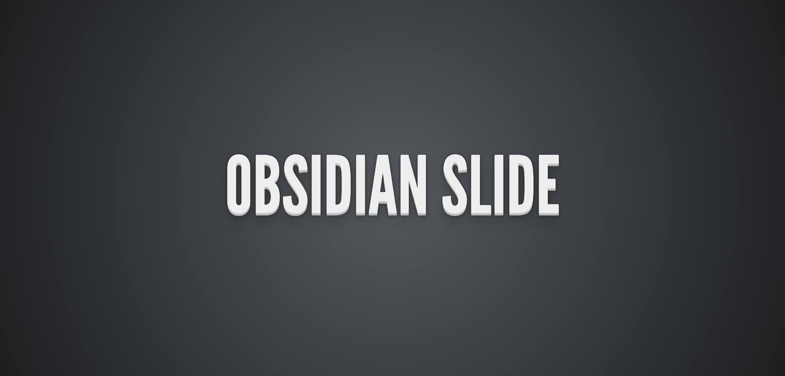
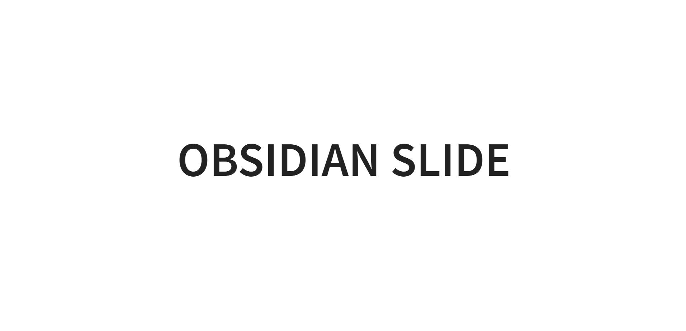

# ObsidianSlide介绍

Obsidian是一款基于reveal.js、使用Markdown语法制作ppt的网页应用。

# 基于reveal.js

1. reveal.js提供了较为完整的底层，在demo.html中写入html或者markdown即可生成页面，如：

```html
<div class="reveal">

    <!-- Any section element inside of this container is displayed as a slide -->
    <div class="slides">
      <section data-markdown>
        <textarea data-template>
      # 首页
      * 1
      * 2
      *3
        </textarea>
      </section>

      <section data-markdown>
        <textarea data-template>
      ## 常见问题1
        </textarea>
      </section>

      <section>
        <section data-markdown>
          <textarea data-template>
          ## 常见问题2
        </textarea>
        </section>
        <section data-markdown>
          <textarea data-template>
          ## 常见问题2-1
          </textarea>
        </section>
        <section data-markdown>
          <textarea data-template>
           ## 常见问题2-2
           </textarea>
        </section>
      </section>
    </div>

```

# 核心代码

1. 添加Js使用户直接编写markdown字符串就可以自动解析成上述html

* 根据我们的规定，使用正则表达式对markdown内容进行判断

```javascript
// 是否是1，2个#号
    function isMain(str) {
      return (/^#{1,2}(?!#)/).test(str)
    }

    // 是否是3个#号的
    function isSub(str) {
      return (/^#{3}(?!#)/).test(str)
    }

    function convert(raw) {
      let arr = raw.split(/\n(?=\s*#)/).filter(i => i != '').map(i => i.trim())
      let html = ``

      for (let i = 0; i < arr.length; i++) {
        if (arr[i + 1] !== undefined) {
          if (isMain(arr[i]) && isMain(arr[i + 1])) {
            // 平级
            html += `
              <section data-markdown>
                  <textarea data-template>
                    ${arr[i]}
                  </textarea>
              </section>
  `
          } else if (isMain(arr[i]) && isSub(arr[i + 1])) {
            // 开
            html += `
             <section>
               <section data-markdown>
                 <textarea data-template>
                   ## 常见问题2
                 </textarea>
              </section>
            `
          } else if (isSub(arr[i]) && isSub(arr[i + 1])) {
            // 平级
            html += `
              <section data-markdown>
                  <textarea data-template>
                    ${arr[i]}
                  </textarea>
              </section>
            `
          } else if (isSub(arr[i]) && isMain(arr[i + 1])) {
            // 闭合
            html += `
               <section data-markdown>
                  <textarea data-template>
                    ${arr[i]}
                  </textarea>
               </section>
            </section>
            `
          }
        } else {
          if (isMain(arr[i])) {
            // 平级
            html += `
              <section data-markdown>
                  <textarea data-template>
                    ${arr[i]}
                  </textarea>
              </section>
              `
          } else if (isSub(arr[i])) {
            // 闭合
            html += `
              <section data-markdown>
                  <textarea data-template>
                    ${arr[i]}
                  </textarea>
              </section>
            </section>
              `
          }
        }
      }
      return html
    }
```

* 接下来需要将markdown的字符串添加到document上

```javascript
function loadMarkdown(raw) {
      let html = convert(raw)
      document.querySelector('.slides').innerHTML = html
      // 调用原本的reveal.js

      // More info https://github.com/hakimel/reveal.js#configuration
      Reveal.initialize({
        controls: true,
        progress: true,
        center: true,
        hash: true,

        transition: 'slide', // none/fade/slide/convex/concave/zoom

        // More info https://github.com/hakimel/reveal.js#dependencies
        dependencies: [
          { src: 'plugin/markdown/marked.js', condition: function () { return !!document.querySelector('[data-markdown]'); } },
          { src: 'plugin/markdown/markdown.js', condition: function () { return !!document.querySelector('[data-markdown]'); } },
          { src: 'plugin/highlight/highlight.js' },
          { src: 'plugin/search/search.js', async: true },
          { src: 'plugin/zoom-js/zoom.js', async: true },
          { src: 'plugin/notes/notes.js', async: true }
        ]
      });
    }
```

* 在控制台执行loadMarkdown就可以看到与前面图片一样的效果了

```javascript
loadMarkdown(`# 首页
      * 1
      * 2
      *3
## 常见问题1
## 常见问题2
### 常见问题2-1
### 常见问题2-2

## 常见问题3
`)
```

* 一个问题，由于reveal.js的原因，无法再次调用`Reveal.initialize()`这个函数，再次执行loadMarkdown时页面不会刷新

  * 解决思路：localStorage存入用户输入的字符串，然后刷新页面
  * 添加一个start函数进行初始化（每次刷新页面时）
  * 修改loadMarkdown函数

  ```javascript
      function loadMarkdown(raw) {
        let html = convert(raw)
        // 保存localStorage
        localStorage.markdown = html
        // 刷新页面
        location.reload()
      }
  
      // 初始
      function start() {
        let TPL = `
        # Obsidian Slide
               - 请将鼠标浮于左上角
               - Click and Start！
        `
        let html = convert(localStorage.markdown || TPL)
        document.querySelector('.slides').innerHTML = html
        // 调用原本的reveal.js
        // More info https://github.com/hakimel/reveal.js#configuration
        Reveal.initialize({
          controls: true,
          progress: true,
          center: true,
          hash: true,
  
          transition: 'slide', // none/fade/slide/convex/concave/zoom
  
          // More info https://github.com/hakimel/reveal.js#dependencies
          dependencies: [
            { src: 'plugin/markdown/marked.js', condition: function () { return !!document.querySelector('[data-markdown]'); } },
            { src: 'plugin/markdown/markdown.js', condition: function () { return !!document.querySelector('[data-markdown]'); } },
            { src: 'plugin/highlight/highlight.js' },
            { src: 'plugin/search/search.js', async: true },
            { src: 'plugin/zoom-js/zoom.js', async: true },
            { src: 'plugin/notes/notes.js', async: true }
          ]
        });
      }
      // 调用初始化
      start()
  ```

  

# 菜单栏功能

1. 鼠标浮于左上角出现设置按钮，点击按钮弹出menu，点击menu的叉号关闭menu

* 实现思路

```css
.menu{
display:none
}

.menu.open{
display:block
}
```

* 点击按钮时，动态地给menu添加一个名为open的class
* 点击叉号时，去掉名为open的class

2. 点击menu中的按钮切换content的显示

* 同理
* 区别在于这里用`document.querySelectorAll`取到所有的`content`和`tab`

3. 完整实现代码

```javascript
// DOM方法
function $(s) {
  return document.querySelector(s)
}
function $$(s) {
  return document.querySelectorAll(s)
}

const Menu = {
  init() {
    this.$settingIcon = $('.control .icon-settings')
    this.$menu = $('.menu')
    this.$closeIcon = $('.menu .icon-close')
    this.$$tabs = $$('.menu .tab')
    this.$$contents = $$('.menu .content')

    this.bind()
  },
  // 绑定事件
  bind() {
    this.$settingIcon.onclick = () => {
      // 这里如果使用普通的函数写法this会指向settingIcon
      this.$menu.classList.add('open')
    }
    this.$closeIcon.onclick = () => {
      this.$menu.classList.remove('open')
    }

    this.$$tabs.forEach($tab => $tab.onclick = () => {
      this.$$tabs.forEach($node => $node.classList.remove('active'))
      $tab.classList.add('active')
      let index = [...this.$$tabs].indexOf($tab)
      this.$$contents.forEach($node => $node.classList.remove('active'))
      this.$$contents[index].classList.add('active')
    })
  }
}
const App = {
  init() {
    [...arguments].forEach(Module => Module.init())
  }
}

App.init(Menu)
```

4. 给菜单和内容的显示和消失添加动态效果

* 由于要添加动画效果，原先使用的`display:none`就被我们弃用了，相关的css修改成
* 左边的menu

```css
.menu{
  position:fixed;
  left: 0;
  z-index:100;
  width: 180px;
  height: 100vh;
  background-color: #252f2d;
  color:#74747c;
  font-size:13px;
  /* display:none; */
  transform: translateX(-100%);
  transition: transform .3s;
}

.menu.open{
  transform: translateX(0);
}
```

* 右边的内容

```css
.menu .detail .content{
  position: absolute;
  z-index:999;
  left: 180px;
  top:0;
  width: calc(100vw - 180px);
  height:100vh;
  background: #212a29;
  font-size:14px;
  transform: translateX(100vw);
  /* display: none; */
  transition: transform .3s;
}

.menu.open .detail .content.active{
  /* display: block; */
  transform: translateX(0);
}

```

* 遇到的bug
  
  * 一开始右边内容最后的css我是这么写的
  
  ```css
  .menu .detail .content{
    position: absolute;
    z-index:999;
    left: 180px;
    top:0;
    width: calc(100vw - 180px);
    height:100vh;
    background: #212a29;
    font-size:14px;
    /* 这里是问题1 */
    transform: translateX(100%);
    /* display: none; */
    transition: transform .3s;
  }
  
  /* 这里是问题2 */
  .menu .detail .content.active{
    /* display: block; */
    transform: translateX(0);
  }
  ```
  
  * 这么写导致了content比浏览器的最右边还多出了180px
  * 原因在于content这里用了绝对定位,而menu用的是fixed定位，content的位置会根据menu位置改变而改变
  * 问题2没有给.menu.open会导致关闭menu后content还存在，加上.open就没问题了


# 编辑器功能的实现

1. 这里直接给出代码，思路同核心代码

```javascript
const Menu = {
  init() {
    this.$settingIcon = $('.control .icon-settings')
    this.$menu = $('.menu')
    this.$closeIcon = $('.menu .icon-close')
    this.$$tabs = $$('.menu .tab')
    this.$$contents = $$('.menu .content')

    this.bind()
  },
  // 绑定事件
  bind() {
    this.$settingIcon.onclick = () => {
      // 这里如果使用普通的函数写法this会指向settingIcon
      this.$menu.classList.add('open')
    }
    this.$closeIcon.onclick = () => {
      this.$menu.classList.remove('open')
    }

    this.$$tabs.forEach($tab => $tab.onclick = () => {
      this.$$tabs.forEach($node => $node.classList.remove('active'))
      $tab.classList.add('active')
      let index = [...this.$$tabs].indexOf($tab)
      this.$$contents.forEach($node => $node.classList.remove('active'))
      this.$$contents[index].classList.add('active')
    })
  }
}

const Editor = {
  init() {
    this.$editInput = $('.editor textarea')
    this.$saveBtn = $('.editor .button-save')
    this.markdown = localStorage.markdown || `# obsidian slide
更简洁、更高效
##  
* 鼠标放置在页面左上方进入设置
* 点击右下方箭头可上下左右切换
* 按D键下载，S键进入演讲者模式
## 关于Obsidian Slide
### 一款在线ppt编辑器
* 基于reveal.js
* 更快、更轻
* 更简洁、更高效
### 功能
* Markdown语法制作ppt
* 多种主题与动画
* PDF下载
* 演讲者模式 
## 快速上手
* 设置——内容编辑——保存
* '#'与'##'将占据一页横向页面
* '###'  将占据一页垂直页面
## [前往我的GitHub](https://github.com/Gaocarri/obsidian-slide/) 
    `
    // 给editor初始数据
    this.$editInput.value = this.markdown
    this.bind()
    this.start()
  },
  bind() {
    this.$saveBtn.onclick = () => {
      localStorage.markdown = this.$editInput.value
      location.reload()

    }
  },
  start() {
    document.querySelector('.slides').innerHTML = convert(this.markdown)
    // 调用原本的reveal.js
    // More info https://github.com/hakimel/reveal.js#configuration
    Reveal.initialize({
      controls: true,
      progress: true,
      center: true,
      hash: true,

      transition: 'slide', // none/fade/slide/convex/concave/zoom

      // More info https://github.com/hakimel/reveal.js#dependencies
      dependencies: [
        { src: 'plugin/markdown/marked.js', condition: function () { return !!document.querySelector('[data-markdown]'); } },
        { src: 'plugin/markdown/markdown.js', condition: function () { return !!document.querySelector('[data-markdown]'); } },
        { src: 'plugin/highlight/highlight.js' },
        { src: 'plugin/search/search.js', async: true },
        { src: 'plugin/zoom-js/zoom.js', async: true },
        { src: 'plugin/notes/notes.js', async: true }
      ]
    });
  }
}

const App = {
  init() {
    [...arguments].forEach(Module => Module.init())
  }
}

App.init(Menu, Editor)
```

# 主题切换与过渡动画

1. 如何修改主题:修改league.css就可以修改主题了

```html
  <link rel="stylesheet" href="css/theme/league.css" id="theme">
```

2. 基本html结构

```html
<div class="themes">
            <figure class="select" data-theme="league">
              
              <figcaption>league</figcaption>
            </figure>
            <figure data-theme="white">
              
              <figcaption>white</figcaption>
            </figure>
</div>
```

3. 通过select添加选中效果和主题切换功能

* 自定义属性data-theme
* 通过`$figure.dataset.theme`直接获得它的`data-theme`属性

```javascript
const Theme = {
  init() {
    this.$$figures = $$('.theme figure')

    this.bind()
    this.loadTheme()
  },
  bind() {
    // 选中的样式
    this.$$figures.forEach($figure => $figure.onclick = () => {
      this.$$figures.forEach($item => $item.classList.remove('select'))
      $figure.classList.add('select')
      // 设置主题
      this.setTheme($figure.dataset.theme)
    })
  },
  setTheme(theme) {
    localStorage.theme = theme
    location.reload()
  },
  loadTheme() {
    let theme = localStorage.theme || 'league'
    let $link = document.createElement('link')
    $link.rel = 'stylesheet'
    $link.href = `css/theme/${theme}.css`
    document.head.appendChild($link)
  }
}
```

* 此时会发现一个问题，当切换成功主题后进入设置，select这个class仍然加在第一个figure上，为了解决这个问题，将原来html上的select删除掉并且在`loadTheme()`这个函数上再添加一段代码

```javascript
  loadTheme() {
    let theme = localStorage.theme || 'league'
    let $link = document.createElement('link')
    $link.rel = 'stylesheet'
    $link.href = `css/theme/${theme}.css`
    document.head.appendChild($link)
      
   // 给对应的图片加上select
  Array.from(this.$$figures).find($figure => $figure.dataset.theme === theme).classList.add('select')
  }
  }
```

3. 过渡动画

* 使用localStorage保存用户的选择,Reveal函数里

```javascript
      transition: localStorage.transition || 'slide',
```

* 保存用户选择

```javascript
    // 设置特效
    this.$transition.onchange = function () {
      localStorage.transition = this.value
      location.reload()
```

* 同样的，我们需要给特效加上选择中

```
    // 给对应的特效加上选中
    this.$transition.value = localStorage.transition || 'slide'
```


# PDF下载

1. 点击下载菜单的下载进行下载

* 这里我做项目的时候遇到了一个问题，由于这里我已经给menu的几个菜单都绑定了onclick事件，再绑定onclick就发生了冲突(即没有选中下载PDF这个menu)，思考后使用了addEventListener

2. 考虑到让用户返回当前页面，可以打开一个新的窗口

* 完整代码

```javascript
const Print = {
  init() {
    this.$download = $('.download')

    this.bind()
    this.start()
  },
  bind() {
    this.$download.addEventListener('click', () => {
      let $link = document.createElement('a')
      $link.setAttribute('target', '_blank')
      $link.setAttribute('href', location.href.replace(/#\/.*/, '?print-pdf'))
      $link.click()
    })
  },
  start() {
    // reveal.js自带打印的代码
    var link = document.createElement('link');
    link.rel = 'stylesheet';
    link.type = 'text/css';
    if (window.location.search.match(/print-pdf/gi)) {
      link.href = 'css/print/pdf.css';
      window.print()
    } else {
      link.href = 'css/print/paper.css'
    }
    document.getElementsByTagName('head')[0].appendChild(link);
  }
}
```

# 编辑器上传图片功能

1. 通过leanClound存储图片

* 按照leanClound的JS数据存储开发指南

2. 如何更改input的样式

* 写一个label标签，for=input的id,然后隐藏input，此时点label就等于点input
* 修改label的样式即可

3. 具体代码

```javascript
const ImgUploader = {
  init() {
    this.$fileInput = $('#img-uploader')
    this.$textarea = $('.editor textarea')

    AV.init({
      appId: "yffE6HyyuQsu06EFFoYdvKRq-gzGzoHsz",
      appKey: "DxYM0EXpau7e2ntV5KAB3xCJ",
      serverURLs: "https://yffe6hyy.lc-cn-n1-shared.com"
    })

    this.bind()
  },

  bind() {
    let self = this
    this.$fileInput.onchange = function () {
      if (this.files.length > 0) {
        let localFile = this.files[0]
        console.log(localFile)
        if (localFile.size / 1048576 > 2) {
          alert('文件不能超过2M')
          return
        }
        self.insertText(``)
        let avFile = new AV.File(encodeURI(localFile.name), localFile)

        console.log(avFile)

        avFile.save({
          keepFileName: true,
          onprogress(progress) {
            self.insertText(``)
          }
        }).then(file => {
          console.log('文件保存完成')
          console.log(file)
          let text = ``
          self.insertText(text)
        }).catch(err => console.log(err))
      }
    }
  },

  insertText(text = '') {
    let $textarea = this.$textarea
    let start = $textarea.selectionStart
    let end = $textarea.selectionEnd
    let oldText = $textarea.value

    $textarea.value = `${oldText.substring(0, start)}${text} ${oldText.substring(end)}`
    $textarea.focus()
    $textarea.setSelectionRange(start, start + text.length)
  }
}
```

